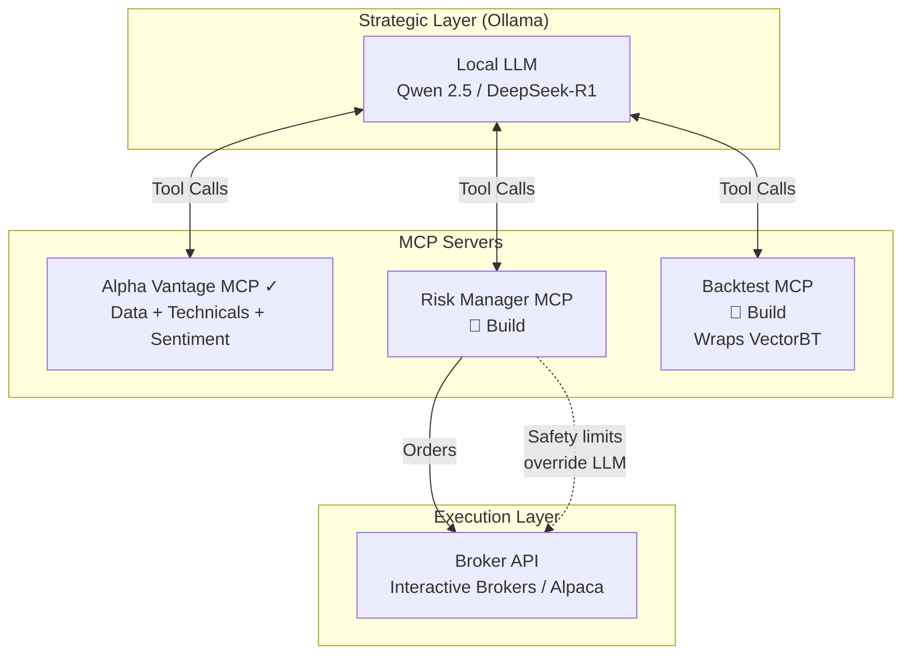
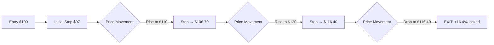
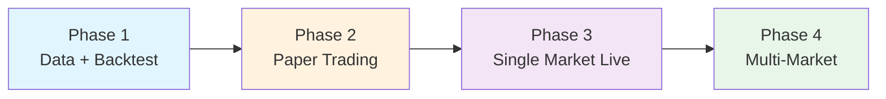

# Trading Spike

An autonomous trading system leveraging the [Alpha Vantage MCP Server](https://mcp.alphavantage.co/) for market data, combining fundamental and technical analysis to identify optimal entry and exit points across multiple markets.

## Goals

- **Markets**: Stocks (UK, US, Asia-Pacific), Crypto, Forex, Commodities
- **Style**: Day trading (intraday)
- **Analysis**: Fundamental + Technical
- **Execution**: Fully autonomous
- **Validation**: Backtesting engine
- **Risk Management**: Trailing stop losses to lock in profits

---

## Architecture

### LLM-Orchestrated Trading System

The system uses a local LLM (via Ollama) as the strategic orchestrator, with MCP servers providing deterministic, reliable execution of fast operations.



### Why This Architecture?

| Layer | Responsibility | Speed |
|-------|---------------|-------|
| **LLM (Strategic)** | Interpret news, combine signals, adapt strategy | 1-15 min cycles |
| **MCP Servers (Tactical)** | Execute decisions, enforce limits, calculate indicators | Real-time |
| **Risk Manager** | Hard safety limits that LLM cannot override | Real-time |

### MCP Servers

| Server | Status | Purpose |
|--------|--------|---------|
| Alpha Vantage MCP | ✅ Exists | Market data, 54 technical indicators, news sentiment, fundamentals |
| Risk Manager MCP | 🔨 Build | Position limits, trailing stops, max daily loss, circuit breakers |
| Backtest MCP | 🔨 Build | Wraps VectorBT for strategy validation |

---

## Data Sources (Alpha Vantage MCP)

| Category | Use Case |
|----------|----------|
| Time Series (intraday/daily) | Price action, trend analysis |
| 50+ Technical Indicators | RSI, MACD, Bollinger Bands, MAs |
| News Sentiment | Market mood, event-driven signals |
| Fundamentals | Value filtering, earnings plays |
| Options Data | Volatility signals, Greeks |
| Economic Indicators | Macro context |
| Forex/Crypto Rates | Multi-market coverage |

---

## Key Design Decisions

### Strategy Architecture

| Option | Pros | Cons |
|--------|------|------|
| **Rule-based DSL** | Transparent, backtestable, auditable | Limited flexibility |
| **ML Model** | Adaptive, pattern discovery | Black box, overfit risk |
| **LLM-driven** | Interprets news/fundamentals | Latency, cost, inconsistency |
| **Hybrid** | Best of both worlds | Complexity |

**Recommendation**: Rule-based for entry/exit signals, LLM for fundamental/news interpretation.

### Trailing Stop Implementation



**Options**:
- **Fixed percentage trail**: e.g., 3% below current price
- **ATR-based trail**: Volatility-adjusted distance
- **Support-level trail**: Based on technical levels

### Multi-Market Considerations

| Market | Hours (GMT) | Broker API Options | Challenges |
|--------|-------------|-------------------|------------|
| UK Stocks (LSE) | 08:00-16:30 | Interactive Brokers, IG, Saxo | Stamp duty (0.5%), liquidity |
| US Stocks | 14:30-21:00 | Alpaca, Interactive Brokers, Tradier | PDT rule if <$25k |
| Asia-Pacific (TSE/ASX) | 00:00-06:00 | Interactive Brokers, Saxo, CMC | TSE lunch break 02:30-03:30, currency risk |
| Crypto | 24/7 | Binance, Coinbase, Kraken | Volatility, fees |
| Forex | 24/5 | OANDA, Interactive Brokers | Leverage risk |
| Commodities | Varies | Interactive Brokers, futures brokers | Contract complexity |

---

## Implementation Phases



| Phase | Focus | Deliverable |
|-------|-------|-------------|
| **1. Data + Backtest** | Alpha Vantage MCP + VectorBT + LLM orchestration | Validate strategies historically |
| **2. Paper Trading** | Risk Manager MCP, simulated execution | Prove real-time viability without capital |
| **3. Single Market Live** | Pick one market (e.g., crypto 24/7) | Real execution with small capital |
| **4. Multi-Market** | Expand to stocks, forex, commodities | Full system |

### Phase 1 Deliverables

- [x] Set up Ollama with Qwen 2.5 or DeepSeek-R1
- [x] Configure Alpha Vantage MCP server
- [x] Build Backtest MCP (wraps VectorBT)
- [x] Create initial trading strategy (RSI mean-reversion)
- [ ] Validate with historical data

---

## Open Questions

- [ ] Broker preference? (Alpaca, Interactive Brokers, Binance, etc.)
- [x] Trailing stop type? **Fixed %** (configurable: 2-5%)
- [x] Entry signal approach? **Mean reversion** (RSI oversold/overbought)

---

## Tech Stack

| Component | Choice | Notes |
|-----------|--------|-------|
| **Language** | Python 3.12+ | Managed with uv |
| **LLM Runtime** | Ollama | Local inference on Mac |
| **LLM Model** | Qwen 2.5 32B / DeepSeek-R1 32B | Good reasoning, fits in memory |
| **Data** | Alpha Vantage MCP | Market data + 54 technical indicators |
| **Backtesting** | VectorBT | Fast vectorized backtests, native trailing stops |
| **Broker API** | TBD | Interactive Brokers, Alpaca, or Binance |

### Ollama Model Recommendations

| Model | Size | Speed | Best For |
|-------|------|-------|----------|
| Qwen 2.5 72B | 40GB | ~15 tok/s | Best reasoning (if memory allows) |
| **Qwen 2.5 32B** | 18GB | ~25 tok/s | Recommended balance |
| **DeepSeek-R1 32B** | 18GB | ~25 tok/s | Deep reasoning, step-by-step |
| Phi-4 14B | 8GB | ~40 tok/s | Fast, lower memory |

---

## Setup

### 1. Install Ollama

```bash
# macOS (Homebrew)
brew install ollama

# Or download directly from https://ollama.com/download
```

Start the Ollama service:
```bash
ollama serve
```

### 2. Pull LLM Model

Choose one of the recommended models:

```bash
# Recommended: Qwen 2.5 32B (18GB, good balance)
ollama pull qwen2.5:32b

# Alternative: DeepSeek-R1 32B (18GB, step-by-step reasoning)
ollama pull deepseek-r1:32b

# Lighter option: Phi-4 14B (8GB, faster)
ollama pull phi4:14b
```

### 3. Verify Installation

```bash
# Check model is available
ollama list

# Test with a trading analysis prompt
ollama run deepseek-r1:32b "You are a trading analyst. Given RSI at 28 and MACD crossing above signal line, what trading action would you recommend? Be concise."
```

Expected response: The model should identify RSI < 30 as an **oversold condition** and MACD crossover as a **bullish signal**, recommending a potential **buy** opportunity.

> **Note:** DeepSeek-R1 shows "Thinking..." while it reasons step-by-step. This is normal and may take 30-60 seconds for complex prompts.

### 4. Get Alpha Vantage API Key

1. Sign up at https://www.alphavantage.co/support/#api-key
2. Store your API key securely (do not commit to git)

```bash
# Add to your shell profile (.zshrc or .bashrc)
export ALPHA_VANTAGE_API_KEY="your_api_key_here"
```

### 5. Configure Alpha Vantage MCP

The MCP server can be accessed via:

```bash
# Remote HTTP (no installation needed)
https://mcp.alphavantage.co/mcp?apikey=$ALPHA_VANTAGE_API_KEY

# Or run locally
uvx av-mcp $ALPHA_VANTAGE_API_KEY
```

### 6. Test Alpha Vantage API

Verify your API key works with these test commands:

```bash
# Load API key from .env
source .env

# Test quote data
curl -s "https://www.alphavantage.co/query?function=GLOBAL_QUOTE&symbol=AAPL&apikey=$ALPHA_VANTAGE_API_KEY"

# Test RSI indicator
curl -s "https://www.alphavantage.co/query?function=RSI&symbol=AAPL&interval=daily&time_period=14&series_type=close&apikey=$ALPHA_VANTAGE_API_KEY"

# Test news sentiment
curl -s "https://www.alphavantage.co/query?function=NEWS_SENTIMENT&tickers=AAPL&limit=5&apikey=$ALPHA_VANTAGE_API_KEY"
```

**Expected responses:**

| Endpoint | Expected Output |
|----------|-----------------|
| GLOBAL_QUOTE | Current price, change %, volume |
| RSI | Daily RSI values (14-period) |
| NEWS_SENTIMENT | Recent news with sentiment scores (-1 to 1) |

> **Rate Limits:** Free tier allows 25 requests/day. Space out requests by 1+ second to avoid throttling.

### 7. Run Backtest MCP Server

The Backtest MCP server wraps VectorBT for strategy backtesting.

```bash
# Run the server
uv run python -m backtest_mcp.server

# Or via entry point
uv run backtest-mcp
```

**Available Tools:**

| Tool | Description |
|------|-------------|
| `run_backtest` | Run RSI strategy with trailing stops on historical data |
| `get_performance_metrics` | Get detailed performance stats (Sharpe, drawdown, win rate) |
| `optimize_parameters` | Find best RSI window and trailing stop combinations |

**Example usage with Claude:**

```
Run a backtest on AAPL from 2024-01-01 to 2024-12-31
using RSI=14, entry at 30, exit at 70, with 3% trailing stop
```

---

## Trading Strategy

### RSI Mean-Reversion Strategy

The system uses an RSI-based mean-reversion strategy with trailing stops for risk management.

#### Entry Rules
| Condition | Action |
|-----------|--------|
| RSI crosses **below 30** | **BUY** (oversold signal) |

#### Exit Rules
| Condition | Action |
|-----------|--------|
| RSI crosses **above 70** | **SELL** (overbought signal) |
| Price drops **X%** from peak | **SELL** (trailing stop triggered) |

#### Strategy Configurations

| Config | RSI Window | Entry | Exit | Trailing Stop | Use Case |
|--------|------------|-------|------|---------------|----------|
| **Default** | 14 | 30 | 70 | 3% | Balanced approach |
| **Conservative** | 14 | 25 | 75 | 2% | Fewer trades, tighter risk |
| **Aggressive** | 10 | 35 | 65 | 5% | More trades, wider stops |

#### Rationale

- **RSI < 30**: Historically indicates oversold conditions where price may reverse upward
- **RSI > 70**: Historically indicates overbought conditions where price may reverse downward
- **Trailing Stop**: Locks in profits by selling if price retraces from its peak

See [src/backtest_mcp/strategy.py](src/backtest_mcp/strategy.py) for full strategy implementation.
