# Trading Spike

An autonomous trading system leveraging the [Alpha Vantage MCP Server](https://mcp.alphavantage.co/) for market data, combining fundamental and technical analysis to identify optimal entry and exit points across multiple markets.

## Goals

- **Markets**: Stocks (UK, US, Asia-Pacific), Crypto, Forex, Commodities
- **Style**: Day trading (intraday)
- **Analysis**: Fundamental + Technical
- **Execution**: Fully autonomous
- **Validation**: Backtesting engine
- **Risk Management**: Trailing stop losses to lock in profits

---

## Architecture

### LLM-Orchestrated Trading System

The system uses a local LLM (via Ollama) as the strategic orchestrator, with MCP servers providing deterministic, reliable execution of fast operations.

### Why This Architecture?

| Layer | Responsibility | Speed |
|-------|---------------|-------|
| **LLM (Strategic)** | Interpret news, combine signals, adapt strategy | 1-15 min cycles |
| **MCP Servers (Tactical)** | Execute decisions, enforce limits, calculate indicators | Real-time |
| **Risk Manager** | Hard safety limits that LLM cannot override | Real-time |

### MCP Servers

| Server | Status | Purpose |
|--------|--------|---------|
| Alpha Vantage MCP | ✅ Exists | Market data, 54 technical indicators, news sentiment, fundamentals |
| Risk Manager MCP | 🔨 Build | Position limits, trailing stops, max daily loss, circuit breakers |
| Backtest MCP | 🔨 Build | Wraps VectorBT for strategy validation |

---

## Data Sources (Alpha Vantage MCP)

| Category | Use Case |
|----------|----------|
| Time Series (intraday/daily) | Price action, trend analysis |
| 50+ Technical Indicators | RSI, MACD, Bollinger Bands, MAs |
| News Sentiment | Market mood, event-driven signals |
| Fundamentals | Value filtering, earnings plays |
| Options Data | Volatility signals, Greeks |
| Economic Indicators | Macro context |
| Forex/Crypto Rates | Multi-market coverage |

---

## Key Design Decisions

### Strategy Architecture

| Option | Pros | Cons |
|--------|------|------|
| **Rule-based DSL** | Transparent, backtestable, auditable | Limited flexibility |
| **ML Model** | Adaptive, pattern discovery | Black box, overfit risk |
| **LLM-driven** | Interprets news/fundamentals | Latency, cost, inconsistency |
| **Hybrid** | Best of both worlds | Complexity |

**Recommendation**: Rule-based for entry/exit signals, LLM for fundamental/news interpretation.

### Trailing Stop Implementation

```mermaid
flowchart LR
    A[Entry $100] --> B[Initial Stop $97]
    B --> C{Price Movement}
    C -->|Rise to $110| D[Stop → $106.70]
    D --> E{Price Movement}
    E -->|Rise to $120| F[Stop → $116.40]
    F --> G{Price Movement}
    G -->|Drop to $116.40| H[EXIT: +16.4% locked]
```

**Options**:
- **Fixed percentage trail**: e.g., 3% below current price
- **ATR-based trail**: Volatility-adjusted distance
- **Support-level trail**: Based on technical levels

### Multi-Market Considerations

| Market | Hours (GMT) | Broker API Options | Challenges |
|--------|-------------|-------------------|------------|
| UK Stocks (LSE) | 08:00-16:30 | Interactive Brokers, IG, Saxo | Stamp duty (0.5%), liquidity |
| US Stocks | 14:30-21:00 | Alpaca, Interactive Brokers, Tradier | PDT rule if <$25k |
| Asia-Pacific (TSE/ASX) | 00:00-06:00 | Interactive Brokers, Saxo, CMC | TSE lunch break 02:30-03:30, currency risk |
| Crypto | 24/7 | Binance, Coinbase, Kraken | Volatility, fees |
| Forex | 24/5 | OANDA, Interactive Brokers | Leverage risk |
| Commodities | Varies | Interactive Brokers, futures brokers | Contract complexity |

---

## Implementation Phases

| Phase | Focus | Deliverable |
|-------|-------|-------------|
| **1. Data + Backtest** | Alpha Vantage MCP + VectorBT + LLM orchestration | Validate strategies historically |
| **2. Paper Trading** | Risk Manager MCP, simulated execution | Prove real-time viability without capital |
| **3. Single Market Live** | Pick one market (e.g., crypto 24/7) | Real execution with small capital |
| **4. Multi-Market** | Expand to stocks, forex, commodities | Full system |

### Phase 1 Deliverables

- [ ] Set up Ollama with Qwen 2.5 or DeepSeek-R1
- [ ] Configure Alpha Vantage MCP server
- [ ] Build Backtest MCP (wraps VectorBT)
- [ ] Create initial trading strategy
- [ ] Validate with historical data

---

## Open Questions

- [ ] Broker preference? (Alpaca, Interactive Brokers, Binance, etc.)
- [ ] Trailing stop type? (Fixed %, ATR-based, support-level)
- [ ] Entry signal approach? (Momentum, mean reversion, breakouts)

---

## Tech Stack

| Component | Choice | Notes |
|-----------|--------|-------|
| **Language** | Python 3.12+ | Managed with uv |
| **LLM Runtime** | Ollama | Local inference on Mac |
| **LLM Model** | Qwen 2.5 32B / DeepSeek-R1 32B | Good reasoning, fits in memory |
| **Data** | Alpha Vantage MCP | Market data + 54 technical indicators |
| **Backtesting** | VectorBT | Fast vectorized backtests, native trailing stops |
| **Broker API** | TBD | Interactive Brokers, Alpaca, or Binance |

### Ollama Model Recommendations

| Model | Size | Speed | Best For |
|-------|------|-------|----------|
| Qwen 2.5 72B | 40GB | ~15 tok/s | Best reasoning (if memory allows) |
| **Qwen 2.5 32B** | 18GB | ~25 tok/s | Recommended balance |
| **DeepSeek-R1 32B** | 18GB | ~25 tok/s | Deep reasoning, step-by-step |
| Phi-4 14B | 8GB | ~40 tok/s | Fast, lower memory |
